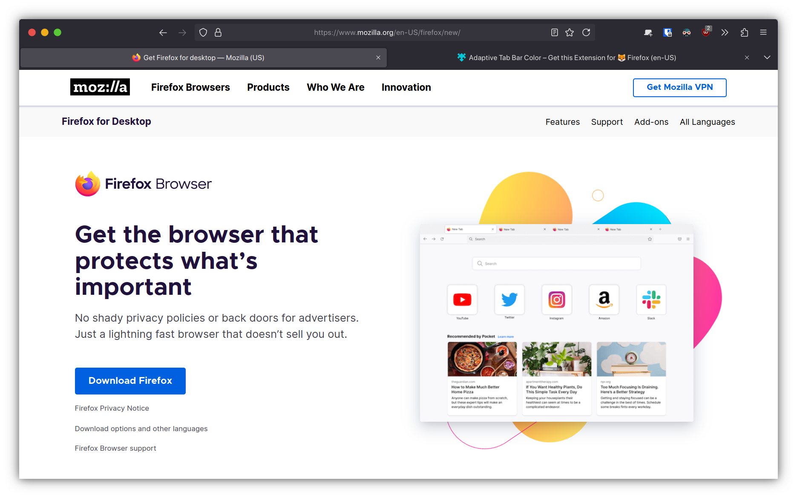

 
# 🦊 Firefox CSS

This repository hosts my firefox theme.

## 🧩 Extensions used

- [Adaptive Tab Bar Color](https://addons.mozilla.org/en-US/firefox/addon/adaptive-tab-bar-color/)
- [Dark Reader](https://addons.mozilla.org/en-US/firefox/addon/darkreader/?utm_source=addons.mozilla.org&utm_medium=referral&utm_content=search)

## 💳 Credits

- [vinceliuice](https://github.com/vinceliuice/WhiteSur-firefox-theme), for some CSS of their "WhiteSur-firefox-theme"

# 🖼️ Screenshots

